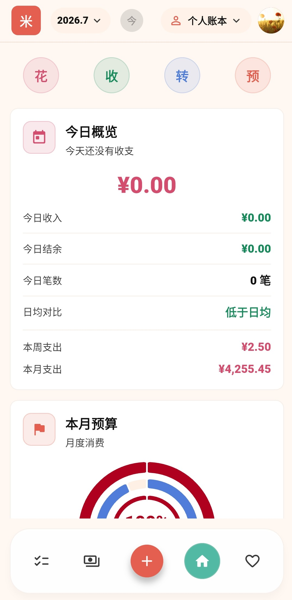
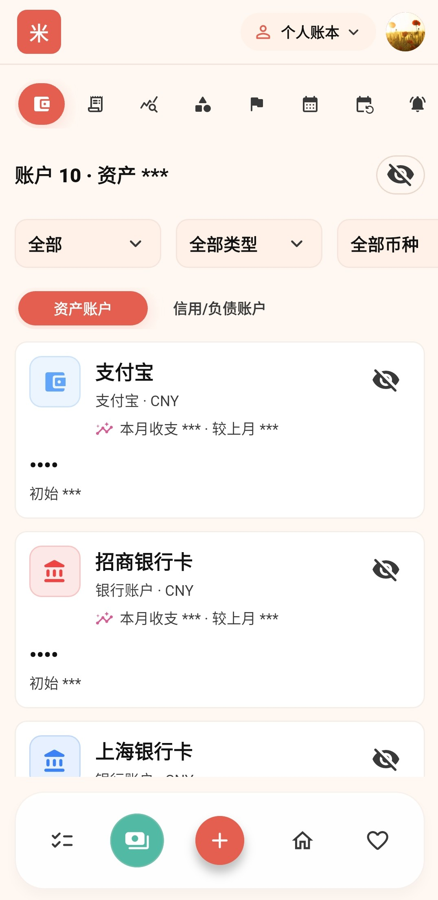
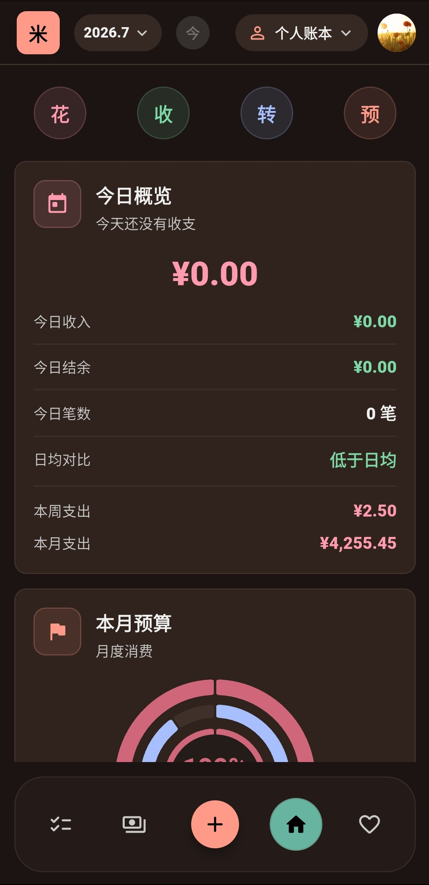
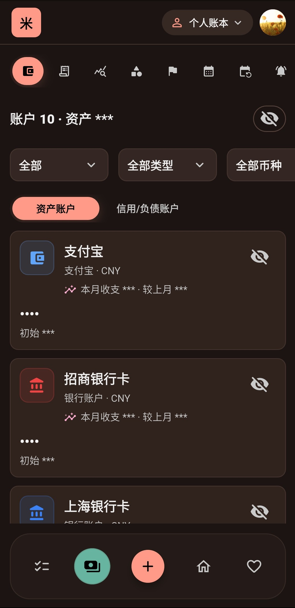

<p align="center">
  <a href="README-zh.md">中文</a> · <strong>English</strong>
</p>

<p align="center">
  <a href="LICENSE"></a>
  
  
  
</p>

# Miji

A local-first, cross-platform personal finance and health tracking app built with Flutter.

## Features

### Bookkeeping

- Multi-account management (cash, bank, Alipay, WeChat, Huabei, Baitiao, investment, loan, etc.)
- Income/expense/transfer records with hierarchical categories, tags, merchants, refunds, installment linking
- Statistics: category distribution, trends, account breakdown, budget performance, anomaly detection
- Budget management: daily/weekly/monthly/billing-cycle/yearly budgets, sub-allocations, overspend alerts
- Installment tracking: record plans, auto-generate period bills
- Bill reminders: credit card repayment, recurring bills
- Auto-posting: scheduled transaction templates
- Bill splitting: equal, fixed amount, percentage, weighted, custom rules
- Ledger system: personal and family ledgers with member management

### Health Tracking

- Menstrual cycle recording and prediction (cycle length, period length, fertile window, PMS)
- Daily health log: flow, 12 symptom types, 6 mood types, exercise, sexual activity, contraception, ovulation tests, medication, diet, water, sleep, weight, temperature, stress, calories
- Calendar view and trend charts
- Pregnancy mode: track weeks, due date
- Personalized cycle settings

### Dashboard

- Daily income/expense overview
- Monthly budget progress
- Asset summary & net worth
- Recent transactions & urgent reminders
- Spending heatmap
- Quick-entry actions

### Security

- Local account login (username/email + password, PBKDF2 hashing)
- App lock (PIN / pattern)
- Sensitive data secondary verification (bookkeeping & health pages)
- Encrypted credential storage via flutter_secure_storage

### Sync

- WebDAV-based backup & sync
- Delta sync with conflict resolution
- Encrypted local snapshot backups

## Screenshots

|           Home (Light / Dark)            |             Account (Light / Dark)             |
| :--------------------------------------: | :--------------------------------------------: |
|  |  |
|    |    |

## Tech Stack

| Layer            | Technology                                                |
| ---------------- | --------------------------------------------------------- |
| Framework        | Flutter + Dart 3.12                                       |
| State Management | Riverpod 3.x + riverpod_annotation                        |
| Navigation       | GoRouter 17.x                                             |
| Database         | Drift (SQLite ORM) + sqlite3                              |
| Code Generation  | freezed, json_serializable, riverpod_generator, drift_dev |
| Charts           | fl_chart                                                  |
| Calendar         | table_calendar                                            |
| Theming          | flex_color_scheme (Material 3)                            |
| Notifications    | flutter_local_notifications                               |
| Security         | flutter_secure_storage, local_auth, cryptography          |
| Icons            | flutter_svg + vector_graphics_compiler                    |
| Fonts            | Google Fonts                                              |

## Getting Started

```bash
git clone <repo-url>
cd miji
flutter pub get
dart run build_runner build
flutter run
```

### Platforms

Android, iOS, Web, Windows, macOS

## Project Structure

```
lib/
├── core/
│   ├── auth/            # Authentication & session management
│   ├── database/        # Drift database definitions & migrations
│   ├── notifications/   # Local notification service
│   ├── preferences/     # User preferences
│   ├── presentation/    # Shared UI components
│   ├── router/          # Route configuration
│   ├── security/        # Password hashing & security
│   ├── sync/            # WebDAV sync & snapshots
│   ├── theme/           # Theming system
│   └── user/            # User entity & repository
├── features/
│   ├── auth/            # Registration / Login / Unlock
│   ├── bookkeeping/     # Bookkeeping module
│   ├── gtd/             # GTD task management (placeholder)
│   ├── health/          # Health tracking module
│   ├── home/            # Dashboard
│   ├── settings/        # Settings pages
│   └── shell/           # App shell & navigation
└── shared/
    └── widgets/         # Reusable form widgets
```

## License

MIT
